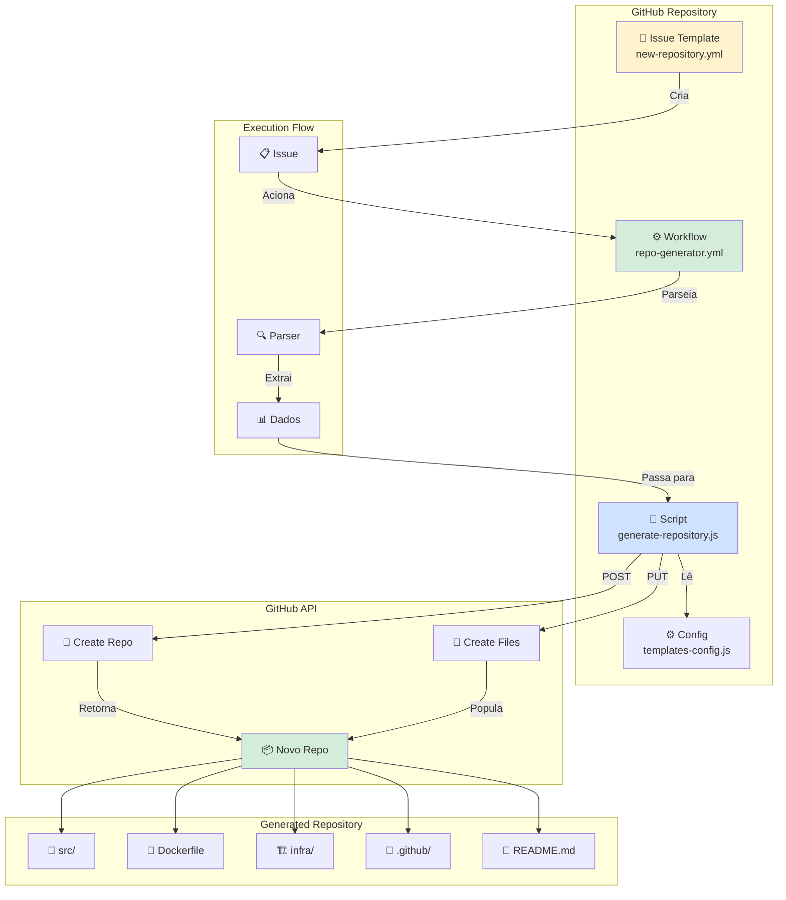
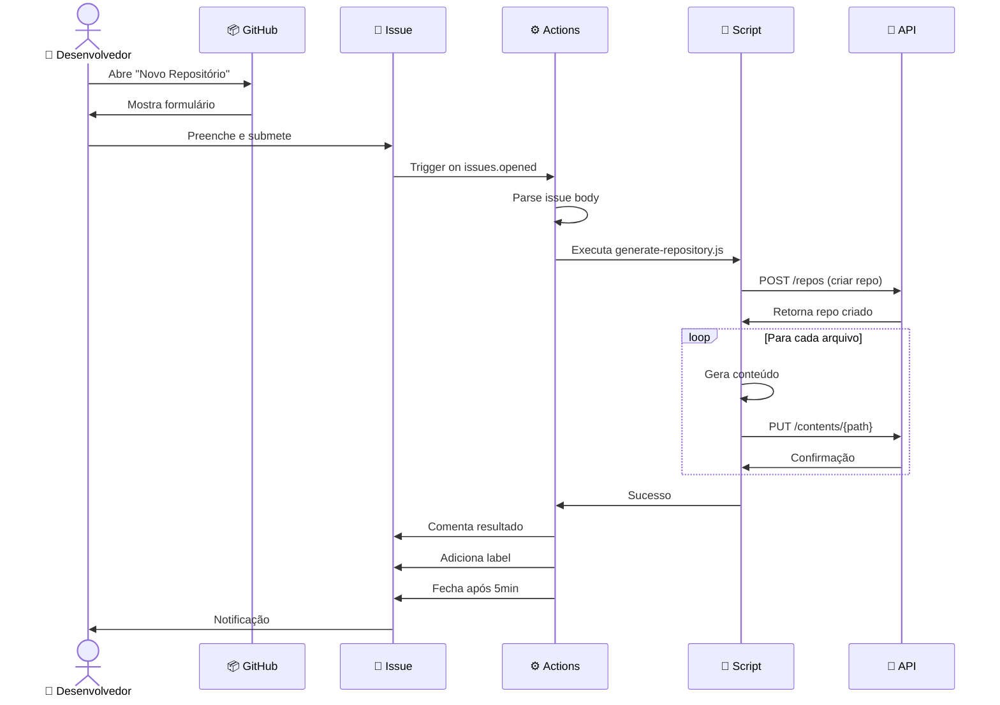
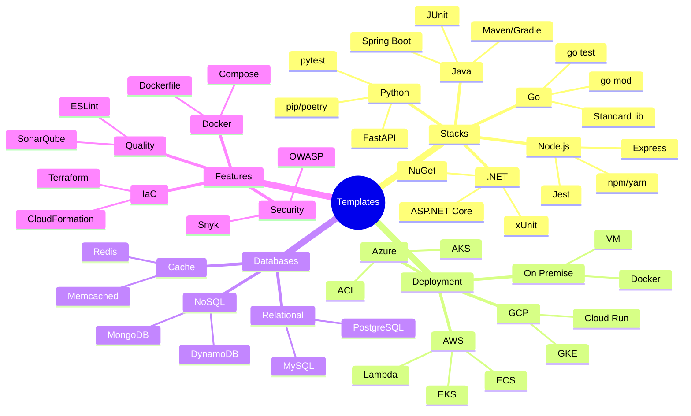
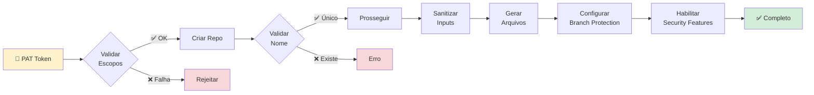

# 🎯 Sistema de Geração Automática de Repositórios

```mermaid
flowchart TD
    Start([👤 Desenvolvedor]) --> Issue[📝 Criar Issue<br/>new-repository]
    Issue --> Form[📋 Preencher Formulário<br/>Stack, Deploy, DB]
    Form --> Submit[✅ Submeter Issue]
    
    Submit --> Trigger{🔄 GitHub Actions<br/>Detecta Issue}
    
    Trigger --> Parse[🔍 Parse Issue Body<br/>Extrair Dados]
    Parse --> Validate{✔️ Validar<br/>Dados}
    
    Validate -->|❌ Inválido| Comment1[💬 Comentar Erro<br/>na Issue]
    Comment1 --> End1([❌ Fim])
    
    Validate -->|✅ Válido| Comment2[💬 Comentar<br/>Processando...]
    Comment2 --> Generate[🏗️ Gerar Repositório<br/>via API]
    
    Generate --> CreateRepo[📦 Criar Repo<br/>no GitHub]
    CreateRepo --> AddFiles[📄 Adicionar Arquivos<br/>Templates]
    
    AddFiles --> Dockerfile{🐳 Precisa<br/>Docker?}
    Dockerfile -->|✅ Sim| Docker[📄 Adicionar<br/>Dockerfile]
    Dockerfile -->|❌ Não| Terraform{🏗️ Precisa<br/>Terraform?}
    Docker --> Terraform
    
    Terraform -->|✅ Sim| TF[📄 Adicionar<br/>infra/*.tf]
    Terraform -->|❌ Não| Workflows{🔄 Configurar<br/>CI/CD?}
    TF --> Workflows
    
    Workflows -->|✅ Sim| GHA[📄 Adicionar<br/>Workflows]
    Workflows -->|❌ Não| Features
    GHA --> Features
    
    Features[✨ Adicionar Features<br/>SonarQube, OWASP, etc]
    Features --> Success[✅ Repositório Criado]
    
    Success --> Comment3[💬 Comentar Sucesso<br/>com Link]
    Comment3 --> Label[🏷️ Adicionar Label<br/>completed]
    Label --> Close[🔒 Fechar Issue<br/>após 5min]
    Close --> Notify[📧 Notificar<br/>Desenvolvedor]
    Notify --> End2([✅ Concluído])

    style Start fill:#e1f5ff
    style Issue fill:#fff3cd
    style Generate fill:#d4edda
    style Success fill:#d4edda
    style End2 fill:#d4edda
    style Comment1 fill:#f8d7da
    style End1 fill:#f8d7da
```



## 📊 Arquitetura do Sistema



## 🔄 Fluxo de Dados



## 📦 Mapeamento de Templates



## 🗂️ Estrutura de Arquivos Gerados

```
novo-repositorio/
├── 📁 .github/
│   ├── 📁 workflows/
│   │   ├── feature.yml          # CI para features
│   │   ├── develop.yml          # CI/CD para develop
│   │   └── deploy.yml           # Deploy production
│   ├── 📁 ISSUE_TEMPLATE/
│   │   ├── bug.yml
│   │   └── feature.yml
│   └── 📄 pull_request_template.md
│
├── 📁 src/                      # Código fonte
│   ├── 📁 main/
│   │   ├── 📁 java|js|py/       # Código da aplicação
│   │   └── 📁 resources/        # Configurações
│   └── 📁 test/                 # Testes
│
├── 📁 infra/                    # Infraestrutura como código
│   ├── main.tf
│   ├── variables.tf
│   ├── outputs.tf
│   └── 📁 ecs|eks|lambda/       # Configs específicas
│
├── 📁 docs/                     # Documentação
│   ├── architecture.md
│   └── api.md
│
├── 🐳 Dockerfile                # Container definition
├── 🐳 docker-compose.yml        # Local development
├── 📦 pom.xml|package.json      # Dependencies
├── 📖 README.md                 # Documentação principal
├── 📄 .gitignore
├── 📄 .dockerignore
└── 📝 CHANGELOG.md
```

## 🎯 Matriz de Compatibilidade

| Stack | ECS | EKS | Lambda | On-Prem |
|-------|-----|-----|--------|---------|
| Java | ✅ | ✅ | ✅ | ✅ |
| Node.js | ✅ | ✅ | ✅ | ✅ |
| Python | ✅ | ✅ | ✅ | ✅ |
| .NET | ✅ | ✅ | ❌ | ✅ |
| Go | ✅ | ✅ | ✅ | ✅ |

## 📈 Timeline de Execução

```
┌─────────────────────────────────────────────────────────────┐
│ Tempo  │ Ação                                                │
├────────┼─────────────────────────────────────────────────────┤
│ t+0s   │ 📝 Issue criada                                     │
│ t+5s   │ ⚙️  Workflow iniciado                                │
│ t+10s  │ 🔍 Dados parseados                                   │
│ t+15s  │ ✅ Validação concluída                               │
│ t+20s  │ 💬 Primeiro comentário                               │
│ t+30s  │ 🏗️  Repositório criado                               │
│ t+45s  │ 📄 Arquivos sendo adicionados                        │
│ t+90s  │ 📦 Template completo                                 │
│ t+120s │ ✅ Sucesso! Link postado                             │
│ t+5m   │ 🔒 Issue fechada automaticamente                     │
└─────────────────────────────────────────────────────────────┘
```

## 🔐 Fluxo de Segurança



---

**Legenda:**
- 📝 Issue/Template
- ⚙️ Workflow/Automação
- 🔧 Script/Código
- 🔌 API/Integração
- 📦 Repositório
- 🐳 Docker
- 🏗️ Infraestrutura
- ✅ Sucesso
- ❌ Erro
