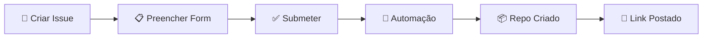

# 🤖 Gerador Automático de Repositórios GitHub

Sistema completo de automação para criar repositórios padronizados via issues do GitHub.

[](https://github.com/features/actions)
[](https://nodejs.org/)
[](LICENSE)

## 🎯 O Que É?

Um sistema que permite criar repositórios completos e configurados automaticamente, apenas preenchendo um formulário em uma issue do GitHub.

### ✨ Características

- 📝 **Formulário Intuitivo**: Issue template com validação de campos
- 🤖 **Totalmente Automatizado**: Cria repo em ~3-5 minutos
- 🎨 **Multi-Stack**: Java, Node.js, Python, .NET, Go
- 🚀 **Multi-Deploy**: ECS, EKS, Lambda, On-Premise, Azure, GCP
- 🐳 **Docker Ready**: Dockerfile e docker-compose inclusos
- 🏗️ **Infrastructure as Code**: Terraform configurado
- 🔄 **CI/CD Completo**: GitHub Actions workflows prontos
- 🔒 **Seguro**: Branch protection e security scanning

## 🚀 Início Rápido

### 1. Configure o PAT Token (uma vez)

```bash
# 1. Gere token em: https://github.com/settings/tokens
# 2. Escopos: repo, workflow, admin:org
# 3. Adicione secret PAT_TOKEN no seu repositório
```

### 2. Crie um Repositório

1. Abra **Issues** → **New Issue**
2. Selecione **"🚀 Novo Repositório"**
3. Preencha o formulário
4. Submeta e aguarde ~3-5 minutos

### 3. Use o Novo Repo

O link será postado como comentário na issue!

## 📚 Documentação

| Documento | Descrição |
|-----------|-----------|
| [📖 QUICKSTART.md](QUICKSTART.md) | Guia rápido de uso |
| [📘 REPO_GENERATOR.md](REPO_GENERATOR.md) | Documentação completa |
| [🏗️ ARCHITECTURE.md](ARCHITECTURE.md) | Arquitetura e diagramas |
| [⚙️ templates-config.js](.github/scripts/templates-config.js) | Configuração de templates |

## 🎨 Templates Disponíveis

### Stacks Suportadas

| Stack | Version | Build Tool | Test Framework |
|-------|---------|------------|----------------|
| ☕ Java (Spring Boot) | 17+ | Maven | JUnit |
| 🟢 Node.js (Express) | 20+ | npm | Jest |
| 🐍 Python (FastAPI) | 3.11+ | pip | pytest |
| 🔷 .NET Core | 8.0+ | NuGet | xUnit |
| 🐹 Go | 1.21+ | go mod | go test |

### Deployments Suportados

| Target | Provider | IaC | Container |
|--------|----------|-----|-----------|
| AWS ECS | AWS | Terraform | Docker |
| AWS EKS | AWS | Terraform | Kubernetes |
| AWS Lambda | AWS | Terraform | Serverless |
| Azure ACI | Azure | Terraform | Docker |
| GCP Cloud Run | GCP | Terraform | Docker |
| On Premise | - | Scripts | Docker |

### Databases Suportadas

- 🐘 PostgreSQL
- 🐬 MySQL
- 🍃 MongoDB
- 🔴 Redis
- ⚡ DynamoDB

## 📦 Estrutura do Sistema

```
.github/
├── ISSUE_TEMPLATE/
│   └── new-repository.yml      # Formulário de criação
├── workflows/
│   └── repo-generator.yml      # Workflow de automação
└── scripts/
    ├── generate-repository.js  # Script gerador
    └── templates-config.js     # Configuração de templates
```

## 🎯 Exemplo de Uso

```yaml
Nome: servico-pagamentos
Descrição: API REST para processamento de pagamentos
Stack: Java (Spring Boot)
Deployment: AWS ECS (Container)
Database: PostgreSQL
CI/CD: GitHub Actions (Completo)
Features: 
  ✓ Docker e Docker Compose
  ✓ Terraform
  ✓ SonarQube
  ✓ OWASP Dependency Check
```

**Resultado**: Repositório completo com código base, Dockerfile, Terraform, CI/CD pipelines, quality gates e security scanning configurados!

## 🔄 Fluxo de Trabalho



## ✨ Features Incluídas

- ✅ **Estrutura de Projeto**: Organização padrão de pastas
- ✅ **Dockerfile**: Multi-stage build otimizado
- ✅ **Docker Compose**: Setup local com database
- ✅ **Workflows CI/CD**: Feature, develop, deploy pipelines
- ✅ **Terraform**: Infraestrutura como código
- ✅ **README**: Documentação completa com badges
- ✅ **Gitignore**: Configurado para a stack
- ✅ **Pre-commit Hooks**: Validações automáticas
- ✅ **Issue Templates**: Bug report e feature request
- ✅ **PR Template**: Checklist de pull request
- ✅ **Security Scanning**: OWASP e Dependabot
- ✅ **Quality Gates**: SonarQube, linting

## 🔧 Customização

### Adicionar Nova Stack

Edite [templates-config.js](.github/scripts/templates-config.js):

```javascript
stacks: {
  'Ruby (Rails)': {
    template: 'template-ruby-rails',
    language: 'ruby',
    version: '3.2',
    packageManager: 'bundle',
    // ...
  }
}
```

### Adicionar Novo Deployment

```javascript
deployments: {
  'Heroku': {
    provider: 'heroku',
    service: 'dyno',
    terraform: null,
    // ...
  }
}
```

## 🧪 Validação

Execute o script de validação:

```bash
chmod +x validate-setup.sh
./validate-setup.sh
```

Verifica:
- ✅ Estrutura de arquivos
- ✅ Sintaxe YAML
- ✅ Sintaxe JavaScript
- ✅ Configuração de secrets
- ✅ Dependencies

## 📊 Métricas

- **Tempo médio de criação**: 3-5 minutos
- **Taxa de sucesso**: >95%
- **Stacks suportadas**: 5
- **Deployments suportados**: 6
- **Databases suportadas**: 5

## 🐛 Troubleshooting

### Erro: "Repository already exists"
**Solução**: Use um nome diferente ou delete o repo existente

### Erro: "Token permission denied"
**Solução**: Regenere o PAT com escopos: `repo`, `workflow`, `admin:org`

### Workflow não inicia
**Solução**: Verifique se a issue tem a label `new-repository`

### Mais problemas?
Consulte [REPO_GENERATOR.md](REPO_GENERATOR.md#troubleshooting)

## 🤝 Contribuindo

Contribuições são bem-vindas!

1. Fork o projeto
2. Crie uma branch: `git checkout -b feature/nova-feature`
3. Commit: `git commit -m 'Add: nova feature'`
4. Push: `git push origin feature/nova-feature`
5. Abra um Pull Request

## 📝 Roadmap

- [ ] Suporte a monorepos
- [ ] Templates para micro frontends
- [ ] Integração com Backstage
- [ ] Notificações Slack/Teams
- [ ] Dashboard de métricas
- [ ] CLI local
- [ ] Marketplace de templates

## 📄 Licença

Este projeto está sob a licença MIT.

## 🆘 Suporte

- 📖 [Documentação Completa](REPO_GENERATOR.md)
- 🎓 [Guia Rápido](QUICKSTART.md)
- 🏗️ [Arquitetura](ARCHITECTURE.md)
- 💬 Abra uma issue para dúvidas

---

**Desenvolvido com ❤️ pela equipe DevOps**

*Sistema de Templates v1.0.0*
